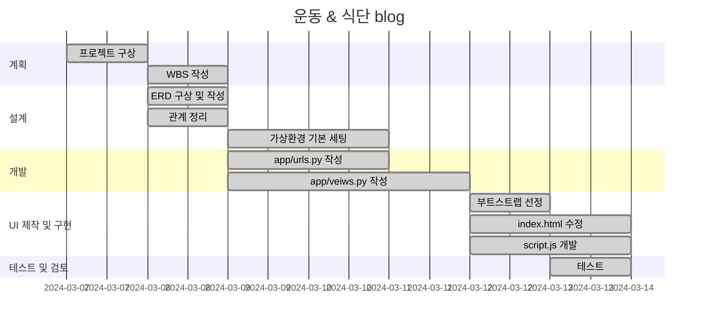
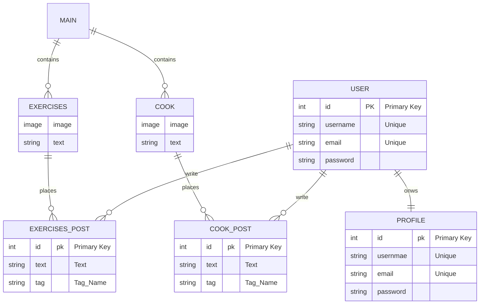

# 운동 및 식단 블로그

* 운동루틴 및 식단의 기록 및 한달 종합 인증을 위한 서비스

## WBS

* WBS

```mermaid
gantt
    title 운동 & 식단 blog
    dateFormat  YYYY-MM-DD
    section 계획
    프로젝트 구상        :done,     des1, 2024-03-07, 1d
    WBS 작성            :done,     des1, 2024-03-08, 1d
 
    section 설계
    ERD 구상 및 작성     :done,     des1, 2024-03-08, 1d
    관계 정리            :done,     des1, 2024-03-08, 1d 
    가상환경 기본 세팅    :done,     des1, 2024-03-09, 2d

    section 개발
    app/urls.py 작성    :done,     des1, 2024-03-09, 2d
    app/veiws.py 작성   :done,     des1, 2024-03-09, 3d

    section UI 제작 및 구현
    부트스트랩 선정      :done,     des1, 2024-03-12, 1d
    index.html 수정     :done,     des1, 2024-03-12, 2d
    script.js 개발      :done,     des1, 2024-03-12, 2d

    section 테스트 및 검토
    테스트             :done,     des1, 2024-03-13, 1d
```

* ERD

```mermaid
erDiagram
    MAIN ||--o{ EXERCISES : "contains"
    MAIN ||--o{ COOK : "contains"
    EXERCISES ||--o{ EXERCISES_POST : "places"
    COOK ||--o{ COOK_POST : "places"
    USER ||--o{ EXERCISES_POST : "write"
    USER ||--o{ COOK_POST : "write"
    USER ||--|| PROFILE : "onws"

    USER {
        int id PK "Primary Key"
        string username "Unique"
        string email "Unique"
        string password
    }

    PROFILE {
        int id pk "Primary Key"
        string usernmae "Unique"
        string email "Unique"
        string password
    }

    EXERCISES {
        image image
        string text
    }

    COOK {
        image image
        string text
    }

    EXERCISES_POST {
        int id pk "Primary Key"
        string text "Text"
        string tag "Tag_Name"
    }

    COOK_POST {
    int id pk "Primary Key"
    string text "Text"
    string tag "Tag_Name"
    }
```
