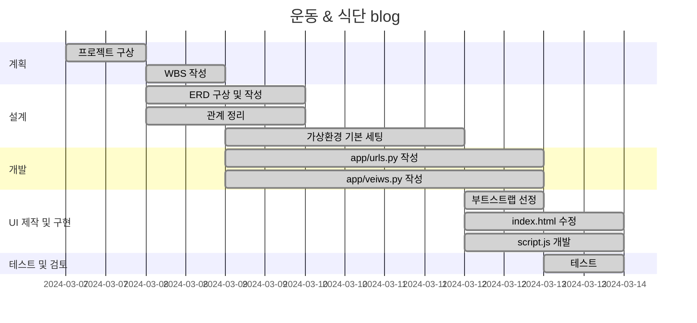
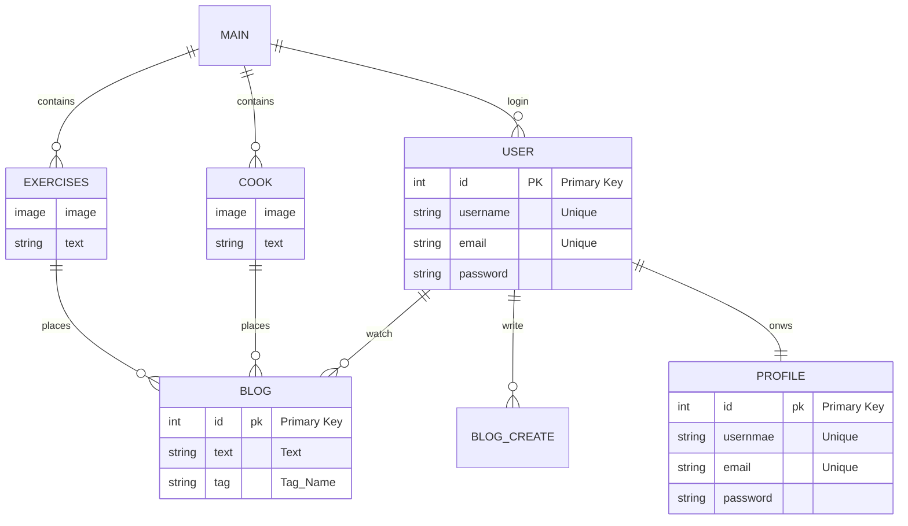
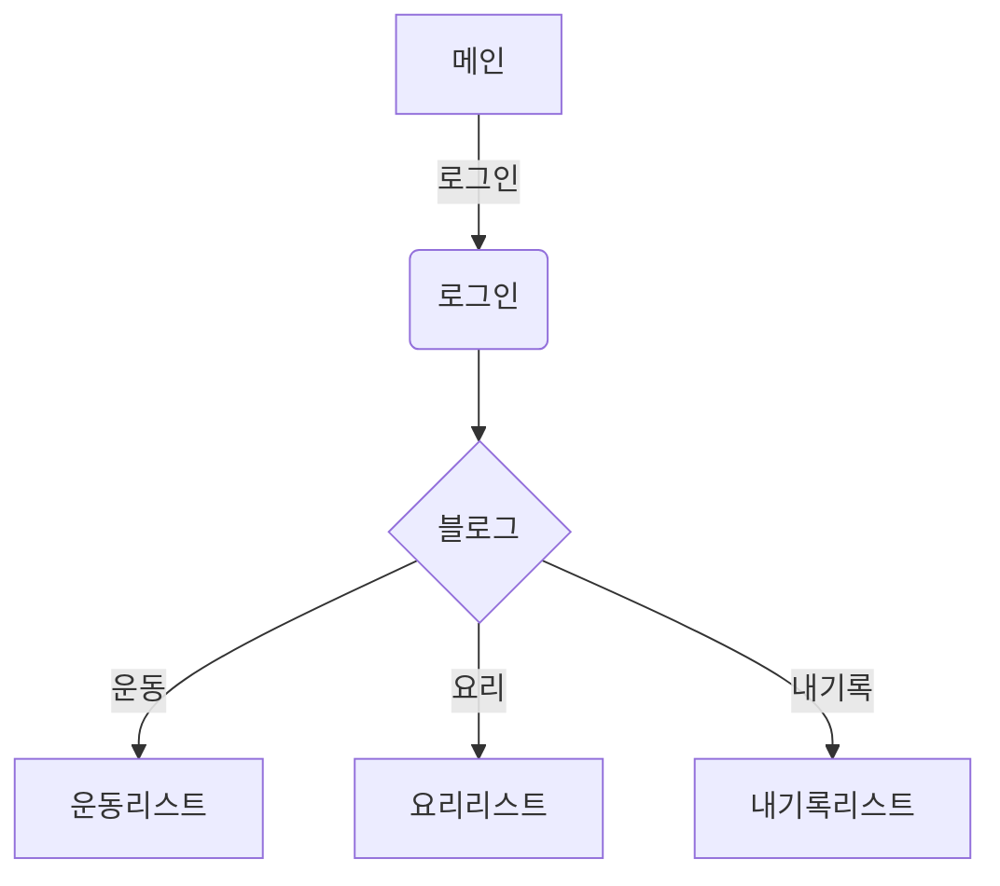

# Project Blog

## 1. 블로그 주제
운동 루틴 및 식단 공유 블로그입니다.

### 1.1 주요기능
* 운동 루틴 공유
* 식단 및 레시피 공유
* 1달의 운동기록 및 식단 모아보기

### 1.2 실현기능
* 로그인
* 블로그 읽기, 작성, 수정
* 댓글작성

## 2. 개발 일정


## 3. 개발 환경 및 URL 구조

### 3.1 개발 환경
* Visual Studio Code

### 3.2 URL 구조
- main

| App       | URL                                        | Views Function    | HTML File Name                        | Note           |
|-----------|--------------------------------------------|-------------------|---------------------------------------|----------------|
| main      | '/'                                        | home              | main/index.html                       | 홈화면          |

- accounts

| App       | URL                                        | Views Function    | HTML File Name                        | Note           |
|-----------|--------------------------------------------|-------------------|---------------------------------------|----------------|
| accounts      | 'login/'                               | login             | accounts/login.html                   | 로그           |
| accounts      | 'logout/'                              | logout            | accounts/login.html                   | 로그아웃         |
| accounts      | 'signup/'                              | signup            | accounts/login.html                   | 회원가입         |
| accounts      | 'profile/'                             | profile           | accounts/login.html                   | 프로필         |

- blog

| App       | URL                                        | Views Function    | HTML File Name                        | Note           |
|-----------|--------------------------------------------|-------------------|---------------------------------------|--------------------------|
| blog      | '/'                                        | blog              | blog/blog_list.html                   | 블로그 리스트            |
| blog      | 'detail/'                                  | detail            | blog/blog_detail.html                 | 포스트 상세페이지        |
| blog      | 'create/'                                  | create            | blog/blog_create.html                 | 포스트 작성              |
| blog      | 'update/'                                  | update            | blog/blog_update.html                 | 포스트 수정 및 업데이트   |

* ERD


* 메인기능


## 4. 프로젝트 구조
```
📦blog
 ┣ 📂accounts
 ┃ ┣ 📂migrations
 ┃ ┃ ┣ 📂__pycache__
 ┃ ┃ ┃ ┗ 📜__init__.cpython-312.pyc
 ┃ ┃ ┗ 📜__init__.py
 ┃ ┣ 📂__pycache__
 ┃ ┃ ┣ 📜admin.cpython-312.pyc
 ┃ ┃ ┣ 📜apps.cpython-312.pyc
 ┃ ┃ ┣ 📜models.cpython-312.pyc
 ┃ ┃ ┣ 📜urls.cpython-312.pyc
 ┃ ┃ ┣ 📜views.cpython-312.pyc
 ┃ ┃ ┗ 📜__init__.cpython-312.pyc
 ┃ ┣ 📜admin.py
 ┃ ┣ 📜apps.py
 ┃ ┣ 📜models.py
 ┃ ┣ 📜tests.py
 ┃ ┣ 📜urls.py
 ┃ ┣ 📜views.py
 ┃ ┗ 📜__init__.py
 ┣ 📂blog
 ┃ ┣ 📂migrations
 ┃ ┃ ┣ 📂__pycache__
 ┃ ┃ ┃ ┣ 📜0001_initial.cpython-312.pyc
 ┃ ┃ ┃ ┣ 📜0002_alter_post_video_file.cpython-312.pyc
 ┃ ┃ ┃ ┗ 📜__init__.cpython-312.pyc
 ┃ ┃ ┣ 📜0001_initial.py
 ┃ ┃ ┣ 📜0002_alter_post_video_file.py
 ┃ ┃ ┗ 📜__init__.py
 ┃ ┣ 📂__pycache__
 ┃ ┃ ┣ 📜admin.cpython-312.pyc
 ┃ ┃ ┣ 📜apps.cpython-312.pyc
 ┃ ┃ ┣ 📜forms.cpython-312.pyc
 ┃ ┃ ┣ 📜models.cpython-312.pyc
 ┃ ┃ ┣ 📜urls.cpython-312.pyc
 ┃ ┃ ┣ 📜views.cpython-312.pyc
 ┃ ┃ ┗ 📜__init__.cpython-312.pyc
 ┃ ┣ 📜admin.py
 ┃ ┣ 📜apps.py
 ┃ ┣ 📜forms.py
 ┃ ┣ 📜models.py
 ┃ ┣ 📜tests.py
 ┃ ┣ 📜urls.py
 ┃ ┣ 📜views.py
 ┃ ┗ 📜__init__.py
 ┣ 📂main
 ┃ ┣ 📂migrations
 ┃ ┃ ┣ 📂__pycache__
 ┃ ┃ ┃ ┗ 📜__init__.cpython-312.pyc
 ┃ ┃ ┗ 📜__init__.py
 ┃ ┣ 📂__pycache__
 ┃ ┃ ┣ 📜admin.cpython-312.pyc
 ┃ ┃ ┣ 📜apps.cpython-312.pyc
 ┃ ┃ ┣ 📜models.cpython-312.pyc
 ┃ ┃ ┣ 📜urls.cpython-312.pyc
 ┃ ┃ ┣ 📜views.cpython-312.pyc
 ┃ ┃ ┗ 📜__init__.cpython-312.pyc
 ┃ ┣ 📜admin.py
 ┃ ┣ 📜apps.py
 ┃ ┣ 📜models.py
 ┃ ┣ 📜tests.py
 ┃ ┣ 📜urls.py
 ┃ ┣ 📜views.py
 ┃ ┗ 📜__init__.py
 ┣ 📂media
 ┃ ┗ 📂blog
 ┣ 📂static
 ┃ ┣ 📂css
 ┃ ┃ ┗ 📜style.css
 ┃ ┣ 📂js
 ┃ ┃ ┗ 📜main.js
 ┃ ┣ 📂scss
 ┃ ┃ ┣ 📜style.scss
 ┃ ┃ ┣ 📜_credits.scss
 ┃ ┃ ┣ 📜_general.scss
 ┃ ┃ ┣ 📜_header.scss
 ┃ ┃ ┣ 📜_nav.scss
 ┃ ┃ ┣ 📜_sections.scss
 ┃ ┃ ┗ 📜_variables.scss
 ┃ ┗ 📂vendor
 ┃ ┃ ┣ 📂bootstrap
 ┣ 📂templates
 ┃ ┣ 📂accounts
 ┃ ┃ ┗ 📜login.html
 ┃ ┣ 📂blog
 ┃ ┃ ┣ 📜blog_create.html
 ┃ ┃ ┣ 📜blog_detail.html
 ┃ ┃ ┣ 📜blog_list.html
 ┃ ┃ ┗ 📜blog_update.html
 ┃ ┣ 📂main
 ┃ ┃ ┗ 📜index.html
 ┃ ┗ 📜base.html
 ┣ 📂tutotialdjango
 ┃ ┣ 📂__pycache__
 ┃ ┃ ┣ 📜settings.cpython-312.pyc
 ┃ ┃ ┣ 📜urls.cpython-312.pyc
 ┃ ┃ ┣ 📜wsgi.cpython-312.pyc
 ┃ ┃ ┗ 📜__init__.cpython-312.pyc
 ┃ ┣ 📜asgi.py
 ┃ ┣ 📜settings.py
 ┃ ┣ 📜urls.py
 ┃ ┣ 📜wsgi.py
 ┃ ┗ 📜__init__.py
```

* 화면 구현

| 화면 | 위치 |
|------|------|
||메인화면|
||로그인화면|
||회원가입|
||프로필|
||블로그메인화면|
||블로그리스트화면|
||포스트상세페이지|


## 5. 에러
- 에러

| 화면 | 해결방법 |
|------|------|
| |accounts -> urls.py -> app_name="aocuunts" 설정, templats -> index.hrml -> 으로 변경으로 해결|
|  | settings.py 마지막에 ``` python X_FRAME_OPTIONS = "ALLOWALL"\n XS_SHARING_ALLOWED_METHODS = ["POST", "GET", "OPTIONS", "PUT", "DELETE"] ``` 추가하여 해결|

## 6. 개발하며 느낌점

* 확실히 눈으로 보고 따라하는 것보다 없는 상태에서 내가 원하는 기능을 만들면서 해 나아가는 것이 많은 것을 배우게 되는 것 같습니다.
* 배운대로 코드를 짰다고 생각했는데 오류가 나는 경우도 많았고 그 오류를 해결하기 위해 인터넷과 chat GPT를 사용하면서 다양한 방법으로 오류 해결방법을 찾아볼 수 있다고 생각이 들었습니다.
