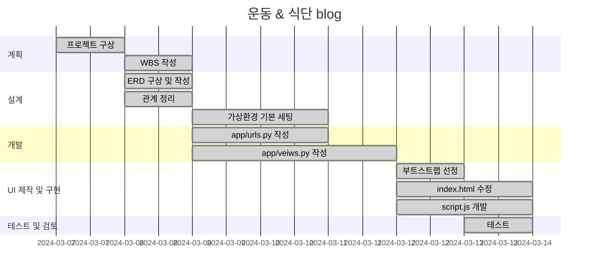
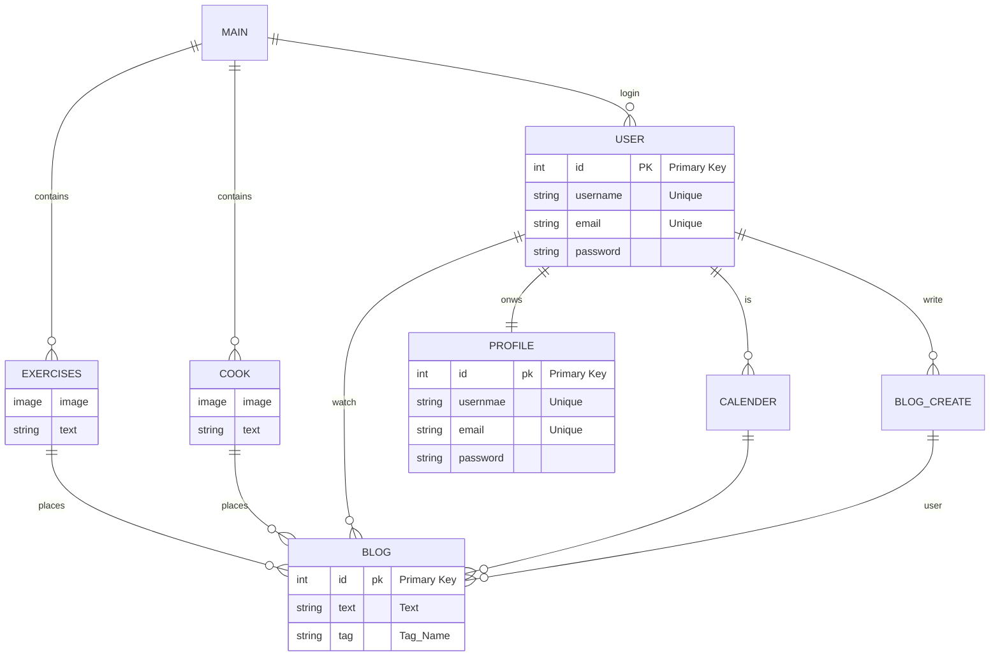

# 운동 및 식단 블로그

* 운동루틴 및 식단의 기록 및 한달 종합기록 확인 서비스
    * 각자의 운동루틴 및 식단을 서로 공유 하며 피드백을 받기도 참고를 하기도 할 수 있으며, 본인이 한달동안 어떤 운동을 했는지 한눈에 확인하므로써 운동의 의욕을 증진 시키고자 만들게 되었습니다.

## WBS
* WBS

* ERD

* URL
|app:accounts|HTTP Method|설명|로그인 권한 필요|작성자 권한 필요|
|:-|:-|:-|:-:|:-:|
|signup/|POST|회원가입|||
|login/|POST|로그인|||
|logout/|POST|로그아웃| ✅ ||
|\<int:pk\>/|GET|프로필 조회| ✅ ||
|\<int:pk\>/|PUT|프로필 수정| ✅ | ✅ |
|\<int:pk\>/|DELETE|회원 탈퇴| ✅ | ✅ |
|status/|GET|로그인 상태 확인|||
|token/refresh/|POST|만료 토큰 재발급|||
   

/                           # 메인
/exercises/                 # 운동 포스트 리스트
/exercises/post             # 운동 포스트 디테일
/exercises/post/create/     # 포스트 작성
/exercises/<str:tag>/       # 해당 카테고리가 달린 목록을 가져와야 합니다.
/cook/                      # 요리 블로그
/post/                      # 포스트 상세페이지
/post/create/               # 포스트 작성
/post/update/<int:pk>/      # 로그인한 사용자만 보기 가능, 자신의 글만 업데이트 가능.(자신의 글에서 수정하기 버튼 노출)
/post/delete/<int:pk>/      # 로그인한 사용자만 보기 가능, 자신의 글만 삭제 가능.(자신의 글에서 삭제하기 버튼 노출)
/post/?q='keyword'          # 해당 키워드가 포함된 title, content가 있는 목록을 가져와야 합니다.
/accounts/signup/           # 회원가입
/accounts/login/            # 로그인
/accounts/logout/           # 로그인한 사용자만 보기 가능
/accounts/profile/          # 로그인한 사용자만 보기 가능

* 와이어프레임
|메인화면||
|카테고리화면||
|포스트화면||

* 작동이미지
